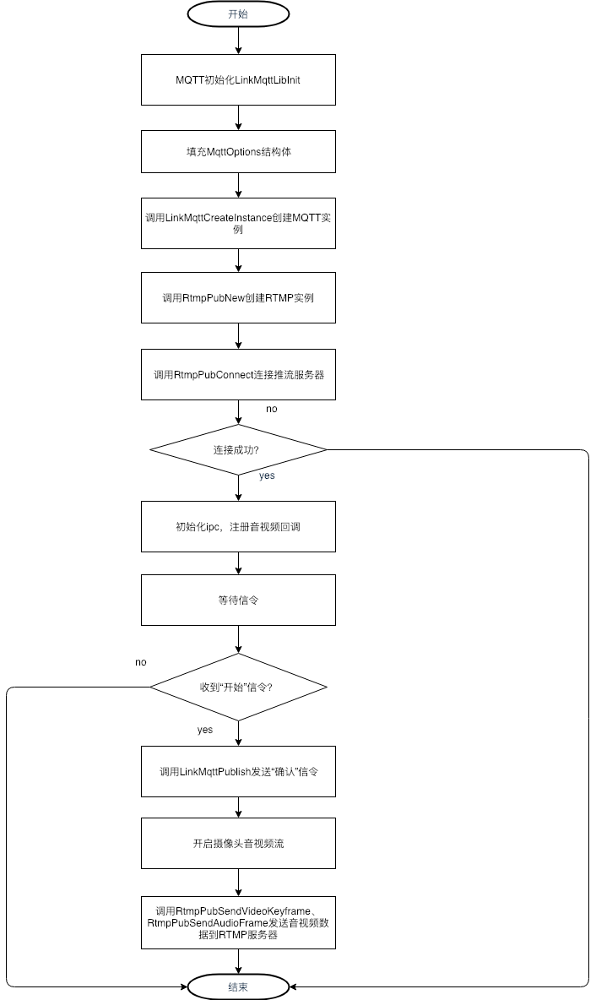

# 目录 | Quick Start Guide

[TOC]

# 1. 概述

本文档主要指导用户基于七牛MQTT和RTMP推流库快速实现可控的RTMP推流。

libmqtt的API文档参照：[MQTT_SDK_API](MQTT_SDK_API.md)

librtmp的API文档参照：[IpCam_SDK_API](IpCam_SDK_API.md)

# 2 功能模块及版本号
| 模块 | 描述 | 版本 |
|---|---|---|
| libmqtt | MQTT信令模块 | 0.0.1 |
| librtmp | RTMP推流模块 | 0.0.1 |

# 3. 快速开始

## 3.1 开发流程
 
- 创建MQTT实例，传入mqtt服务器地址，端口，主题等（ **LinkMqttCreateInstance** ）
- 创建RTMP实例，传入RTMP推流地址，端口，音视频编码参数等（ **RtmpPubNew** ）
- 初始化摄像头，注册视音频回调函数
- 设置视频时间基准 （ **RtmpPubSetVideoTimebase** ）
- 解析视频关键帧，拿到sps，pps，并设置sps，pps( **RtmpPubSetSps/RtmpPubSetPps** )
- 在视频帧的回调里面，发送RTMP流( **RtmpPubSendVideoKeyframe/RtmpPubSendVideoKeyframe** )
- 设置音频时间基准（ **RtmpPubSetAudioTimebase** ）
- 在音频帧的回调里面，发送RTMP流（ **RtmpPubSendAudioFrame** ）
- 等待信令
- 收到“开始”信令，启动推流
- 收到“暂停”信令，停止推流

## 3.2 参考流程图

# 4. sample介绍
- hal目录是对ipc的抽象，将ipc的能力抽象出一个通用的函数操作集。用于支持多个ipc厂商的设备，一个新的ipc厂商如果想让自己的设备能够工作起来，只需要实现CaptureDevice结构体里面的成员，并注册到dev_core，不需要改动其他的代码，就能够使sample工作起来
	- CaptureDevice结构体说明
		- init 摄像头初始化，并注册音频和视频的回调函数
		- deInit 去初始化，可以在此函数释放资源
		- getDevId 获取设备id
		- startStream 开始音视频流
		- isAudioEnable 音频是否是能
		- registerAlarmCb 注册事件回调，比如移动侦测，抓图
		- captureJpeg 抓图函数
		- stopStream 停止音视频流
	- 某个具体的ipc填充好CaptureDevice这个结构体之后，调用函数CaptureDeviceRegister注册到dev_core
	- devices目录下是所有ipc设备存放的目录，sample中使用原始的h264和aac文件模拟出了一个ipc：ipc_simulator.c
- 整体的RTMP推流流程可以参照main.c
- libmqtt_wrapper目录是对libmqtt的二次封装，可以作为libmqtt的使用参考
- librtmp_wrapper目录是对librtmp的二次封装，可以作为librtmp的使用参考

> **注意 ：如果推送的rtmp视音频流有非视音频的数据，比如视频的nalu type既不是0x01也不是0x05，有的播放器无法播放，所以在sample当中对视音频加了过滤的处理，只保留nalu type为0x01和0x05的视频视频数据。音频只保留音频数据 ** 

